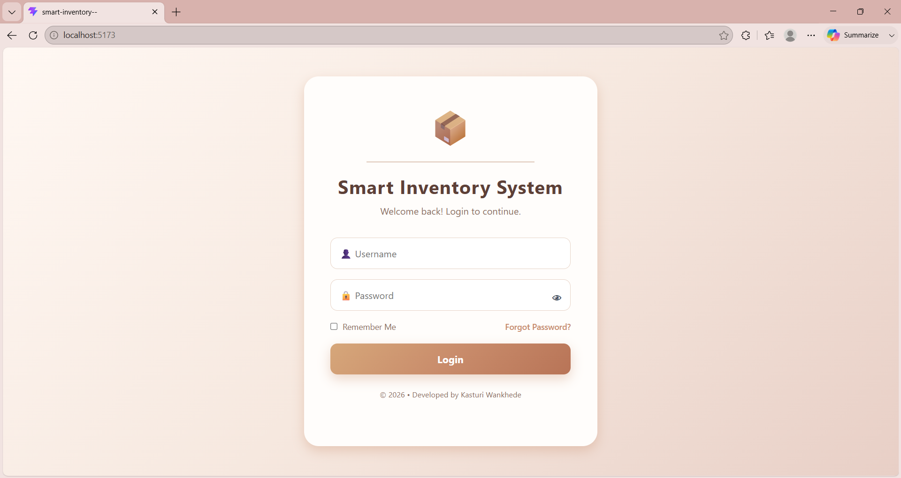
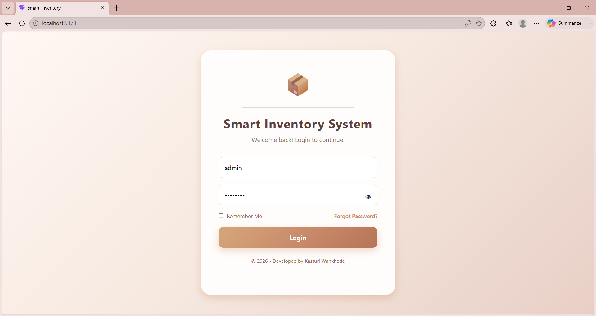
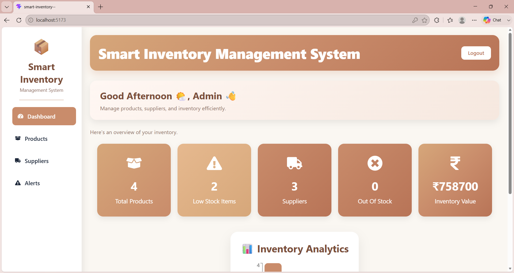
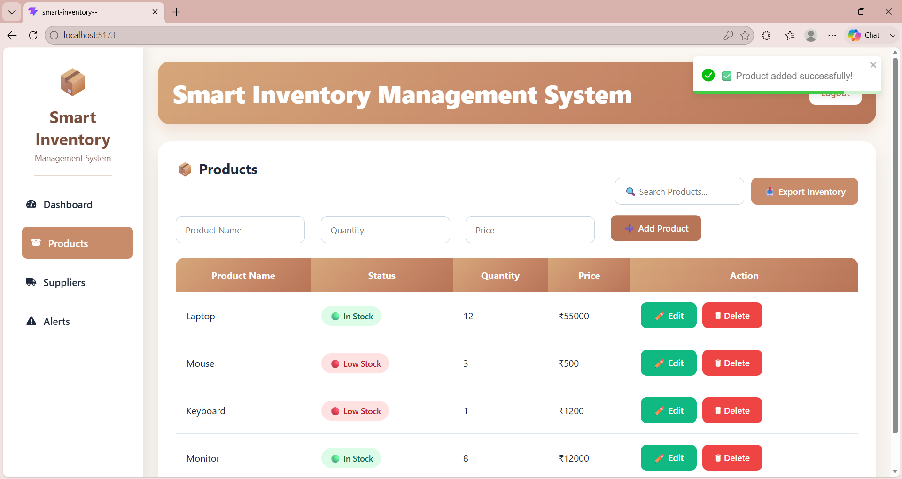
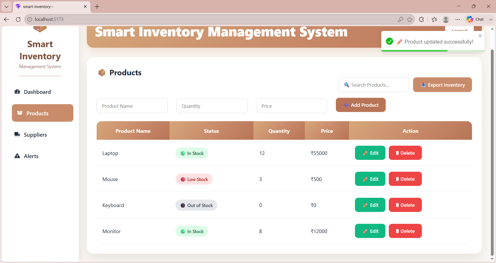
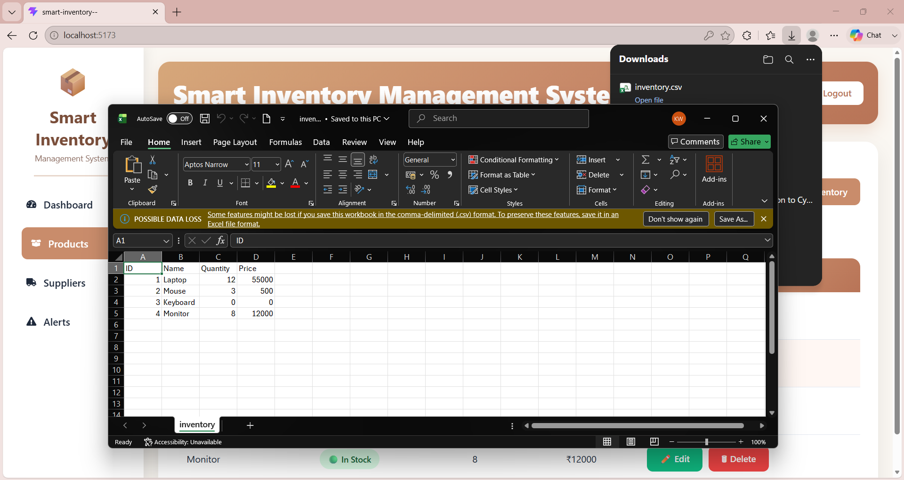
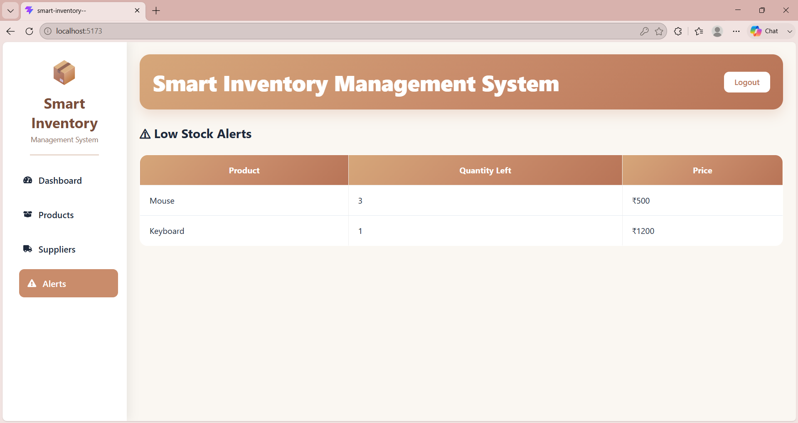
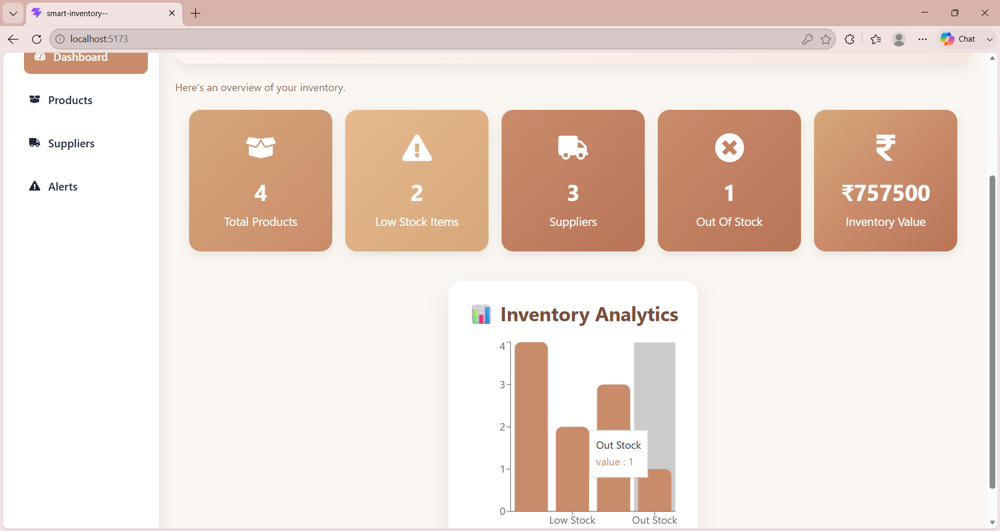

# 📦 Smart Inventory Management System

A full-stack Smart Inventory Management System developed using **React.js**, **FastAPI**, and **SQLite**. This application helps businesses efficiently manage products, suppliers, inventory levels, and stock alerts through a clean and responsive user interface.

---

## 🚀 Features

* 🔐 Login Authentication
* 📦 Product Management (Add, Edit, Delete)
* 🚚 Supplier Management
* 📊 Dashboard with Inventory Statistics
* ⚠️ Low Stock & Out-of-Stock Alerts
* 🔍 Product Search
* 📥 Export Inventory to CSV
* 🔔 Toast Notifications
* 📱 Responsive User Interface

---

## 🛠️ Technologies Used

### Frontend

* React.js
* Axios
* React Toastify
* CSS3

### Backend

* FastAPI
* Python
* SQLite

### Tools

* Git
* GitHub
* Visual Studio Code
* Vite

---

## 📁 Project Structure

```text
smart-inventory/
│
├── src/
│   ├── components/
│   ├── pages/
│   ├── styles/
│   ├── services/
│   └── backend/
│
├── screenshots/
├── README.md
├── package.json
└── vite.config.js
```

---

## ⚙️ Installation

### Clone the Repository

```bash
git clone https://github.com/kasturi-cyber/smart-inventory-management-system.git
```

### Install Dependencies

```bash
npm install
```

### Start Frontend

```bash
npm run dev
```

### Start Backend

```bash
cd src/backend
python -m uvicorn main:app --reload
```

---

## 📌 Key Modules

* Dashboard
* Products
* Suppliers
* Stock Alerts
* Login
* Inventory Analytics

---

## 📈 Future Enhancements

* User Roles (Admin/Employee)
* Barcode Scanner Integration
* Email Notifications
* Cloud Database Support
* Sales & Purchase Reports

---

## 👩‍💻 Developed By

**Kasturi**

B.Tech (Cyber Security)

Internship Project

2026

---

# 📸 Application Screenshots

## 🔐 Login Page



---

## ✅ Login Success



---

## 📊 Dashboard



---

## 📦 Products Management



---

## ✏️ Update Product



---

## 📥 Export Inventory



---

## ⚠️ Stock Alerts



---

## 📈 Inventory Analytics


